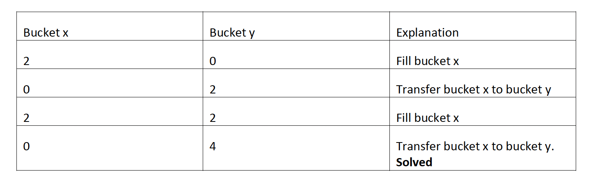
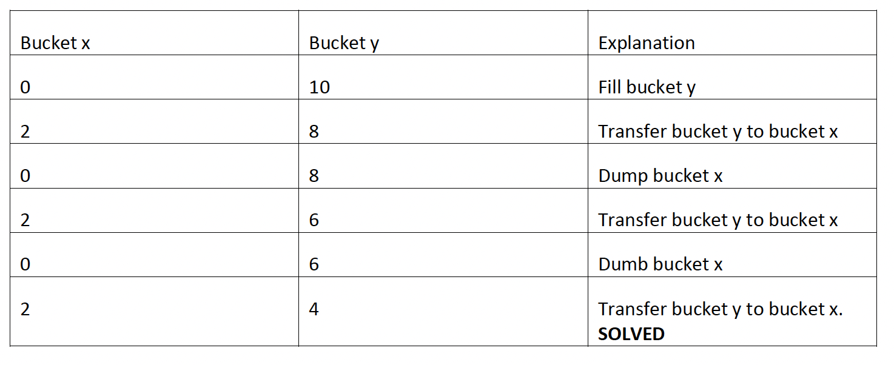

# water-jug-challenge

## Overview 
Build an application that solves the Water Jug Riddle for dynamic inputs (X, Y, Z). The simulation should have a UI (if SPA) to display state changes for each state for each jug (Empty, Full or Partially Full). You have an X-gallon and a Y-gallon jug that you can fill from a lake. (Assume lake has unlimited amount of water.) By using only an X-gallon and Y-gallon jug (no third jug), measure Z gallons of water.

The original problem statement can be found [here](./docs/original_problem_statement.pdf).

## Goals
1. Measure Z gallons of water in the most efficient way.
2. Build a UI where a user can enter any input for X, Y, Z and see the solution.
3. If no solution, display “No Solution”.

## Limitations
• Actions allowed: Fill, Empty, Transfer.
## Deliverables
The application source code should be on Github and a link should be provided. If this is not an option, a public link to the application source code or a zip archive is also acceptable.
Example:
Bucket x: 2
Bucket Y: 10
Amount wanted Z: 4

### Best Solution

### Worst Solution


## Algorithm
The algorithm is designed to solve this problem using a systematic approach. It explores all possible states, generated by the permitted actions, until it finds a solution or determines that no solution exists.

### Understanding the Problem
The Water Jug Challenge involves measuring a specific volume of water (Z gallons) using two jugs with distinct capacities (X and Y gallons). The primary operations allowed are to fill, empty, and transfer water between the jugs.

### The Role of the Extended Euclidean Algorithm
The Extended Euclidean Algorithm plays a crucial role in determining the feasibility of the problem. This algorithm helps to solve linear Diophantine equations of the form aX + bY = GCD(X, Y). For our problem, if Z is a multiple of the GCD of X and Y, then the equation aX + bY = Z has a solution. The coefficients a and b can be found using the Extended Euclidean Algorithm.

### Solvability Check
Before executing the BFS, the algorithm performs a preliminary check to determine if the problem is solvable:
* The target amount must not exceed the capacities of both jugs.
* The target amount must be a multiple of the greatest common divisor (GCD) of the two jug capacities.

### Step-by-Step Approach
1. Define Jug States and Operations
* We define a struct JugState to track the water levels in each jug.
* Operations like pouring water from one jug to another are represented by functions.
2. Greatest Common Divisor (GCD) Function
* Implement a function to compute the GCD of two numbers. This is used in conjunction with the Extended Euclidean Algorithm.
3. Feasibility Check with Extended Euclidean Algorithm
* Before attempting to solve the problem, we use the Extended Euclidean Algorithm to check if a solution is possible.
* We solve the equation aX + bY = GCD(X, Y). If Z is a multiple of the GCD of X and Y, the problem is solvable.
* This step ensures we don't waste resources on an impossible problem.
4. Goal State Check
* A function to check whether the goal (measuring Z gallons) is achieved.
5. Iterative Solution Strategy
* We simulate the process of filling, emptying, and transferring water between the jugs.
* The actions are determined based on the current state of the jugs, aiming to reach the goal state.
* The process continues iteratively, changing the state of the jugs with each action.
6. Execution and Output
* The solution is executed in the main function, where the jug capacities and the target volume are set.
* The program prints each action taken and the resulting state of the jugs.
* It concludes when the goal state is reached or if it's determined that no solution is possible.

### Conclusion
In this solution, the Extended Euclidean Algorithm is pivotal for the initial feasibility check. It mathematically determines whether the goal can be achieved with the given jug sizes. The actual solution, however, follows an iterative, simulation-based approach, translating the theoretical feasibility into practical steps. This combination of mathematical validation with a step-by-step simulation provides a comprehensive solution to the Water Jug Challenge.


## Running the app
To run the app you must have docker and docker-compose installed. Run the following command to start the full application stack:

```console 
make run
```
or

```console 
docker compose -f ./docker-compose.yml up -d --build
```

The app will start in the default http port (80) and you can access it using [this url](http://localhost:8080)

To stop the app run it:

```console 
make stop
```
or

```console 
docker compose -f ./docker-compose.yml down
```